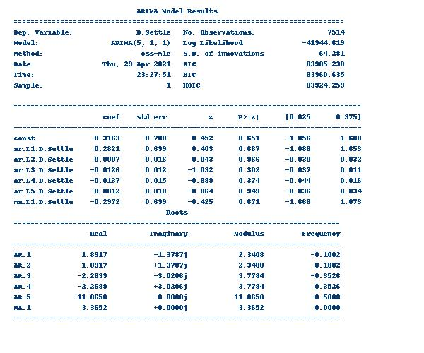

# Unit Ten Submission -  Yen for the Future

## Background

The financial departments of large companies often deal with foreign currency transactions while doing international business. As a result, they are always looking for anything that can help them better understand the future direction and risk of various currencies. Hedge funds, too, are keenly interested in anything that will give them a consistent edge in predicting currency movements.

In this assignment, you will test the many time-series tools that you have learned in order to predict future movements in the value of the Japanese yen versus the U.S. dollar.

You will gain proficiency in the following tasks:

1. Time Series Forecasting
2. Linear Regression Modeling

## Submission Files 

[Time-Series Starter Notebook](submission/time_series_analysis.ipynb)

[Linear Regression Starter Notebook](submission/regression_analysis.ipynb)

## Data Used / Provided 
[Yen Data CSV File](submission/data/yen.csv)

## 1. Time-Series Forecasting

Graph below shows the plot of the settle price of Yen against US Dollar:

 <b> <u> Yen Futures Settle Prices </u> </b> 

 

 
Looking at the plot, in the long-term, the Yen has strengthened against in the long term. In the middleterm, there has been some weakenss (after 20-12). In the shorterm, there seems to be a range bound fluctuation.

---
 

### Hodrick-Prescott Filter 

 Using Hodrick-Prescott Filter , the graphs below show the Settle Price vs. the Trend for 2015 to the present and the noise 
 
 
 <b> <u> Settle Price vs. Trend </u> </b> 

 

 

----

 <b> <u> Settle Noise </u> </b> 

 

---

### ARMA Model 
Running the ARMA model, we get the below summary:
 
 
 <b> <u> ARMA Model</u> </b> 

 

 
Looking at the P values, the model is not a good fit as all the p value are greater than 0.05

---

 
 
 <b> <u> ARMA Model Prediction for 5 Days</u> </b> 

 

---

### ARIMA Model 

Running the ARIMA model, we get the below summary:
 
 
 <b> <u> ARiMA Model</u> </b> 

 

 

Looking at the P values, the model is not a good fit as all the p value are greater than 0.05

--- 

 
 
 <b> <u> ARIMA Model Prediction for 5 Days</u> </b> 

 

---

#### Volatility Forecasting with GARCH

Running the GARCH model, we get the below summary:

 
 
 <b> <u> Garch Model Summary</u> </b> 

 

 
This model is not a good fit, though it is better than the others; all pvalues are greater than 0.05 except the beta1

---

 
 
 <b> <u> GARCH Model based Voaltility Prediction for 5 Days</u> </b> 

 

---

### Conclusions
* Based on our time series analysis, I would buy the yen on 2019-10-15 and sell after five days.The five day forecast shows that it will rise. Data to buy now is not available for anlaysis. 

* The risk of the yen is expected to increase, depicted by GARCH predicted volatality is increasing 

* I would not feel confident in using the models as they are and would look at improving them to bring down the p values. 

## 2. Linear Regression Modeling

In this notebook, is submitted a SKLearn linear regression model to predict Yen futures ("settle") returns with lagged Yen futures returns

The data was split for train/test using 2018-2019 for testing and the rest for training

 
 
 <b> <u> Comparing Predicted vs Test/True Values for Topm 2- records  </u> </b> 

 

--- 

### Performance
Out of sample:

* Out of sample Mean Squared Error is: 0.17262635470120388
* Out of sampleRoot Mean Squared Error is: 0.4154832784856737
---
In sample:

* In-sample  Mean Squared Error is: 0.35565249959422596
* In-sample Root Mean Squared Error is: 0.5963660785073426
--- 
### Conclusion

* The model's out-of-sample data has a root mean squared error of 0.4154832784856737% and the in-sample data's root mean square of 0.5963660785073426 % . 
* The model has performed better on data that is out of sample data i.e. data in the test. We would like to improve the in-sample error percentage
